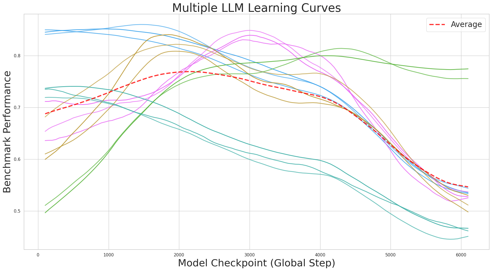

# BOMAX: Bayesian Optimization for Maximizing LLM Learning Curves

<p align="center">
   
</p>

### Using Mult-task Gaussian Process Regression to maximize *average benchmark score* across a sequence of LLM training checkpoints

BOMAX is a Python package for *Bayesian Optimization with Multi-task Gaussian Process Regression*, designed for efficient optimization of expensive-to-evaluate functions across multiple related tasks. The tool was designed with a specific problem in mind, that of choosing the optimal LLM checkpoint, but the code is application-agnostic.

The problem that inspired BOMAX was optimizing LLM learning curves. A learning curve visualizes the performance of a model during training, showing how the performance changes over some time unit (steps/iterations/epochs). In classic ML, the performance is usually measured on a small validation set, sometimes called a *hold-out* set (i.e. 10-20% of the training data is *held out*). The goal is to capture the model parameters at the peak of this curve. However, if we are training/fine-tuning an LLM for multiple uses, our validation set might actually be a combination of many different benchmark tasks. After all, most [LLM-leaderbaords](https://huggingface.co/spaces/open-llm-leaderboard/open_llm_leaderboard#/) rank LLMs by their *average benchmark score*.

<p align="center">
  
   
</p>

Let's say we have a set of model 100 model checkpoints that were saved at regular intervals during training/fine-tuning. Suppose that running a single model on a single benchmark takes 1 minute, and we have 100 benchmark tasks. Running all models on all tasks would take 10000 minutes = 1 week. How could we efficiently estimate the model checkpoint with the highest average benchmark performance without running all model checkpoints through all benchmark tasks?

The key is to use Bayesian Optimization with Multi-task Gaussian Process Regression. Bayesian Optimization (BO for short) is a common approach for such optimization scenarios, when the function we are trying to optimize is expensive to compute. Sometimes it's called "black-box" optimization since we treat the function as a "black-box" and only have access to it by querying it's value at specific points. The basic approach is to repeatedly query (i.e. evaluate) the function so as to acquire more sample points with which to estimate a regression model, and then use that regression model to optimize the function. Naturally this process is a loop, the main steps being:
1. use the current regression model to decide which point $x_i$ to query next
2. update the regression model using newly observed function value $y_i = f(x_i)$

Gaussian process regression models are a popular choice for Bayesian optimization, since they provide explicit uncertainty estimates that can be used to guide step 1. The standard method is through an *acquisition function*, which basically provides a formula for turning the GP uncertainty estimates into the next query point $x_i$. However, the most popular acquisition function, *Expected Improvement*, is not quite suitable for the current problem setting, since it would only be applicable for optimizing a single function (i.e. benchmark), as opposed to an average of multiple functions.

The key to the current software package is a novel formulation of Expected Improvement for optimizing the average of multiple (possibly) correlated functions:

<p align="center">
  <a href="https://davidsvaughn.github.io/bomax/">
     
  </a>
</p>

See [here](https://davidsvaughn.github.io/bomax/) for the [full derivation](https://davidsvaughn.github.io/bomax/).


## Features

- [Novel formulation of Expected Improvement](https://davidsvaughn.github.io/bomax/) for optimizing an average of multiple "black-box" functions
- Uses SOTA [BoTorch](https://botorch.org/) package for GPU-accelerated Bayesian Optimization in PyTorch
- Visualization tools for monitoring optimization progress
- Support for both CPU and GPU acceleration

## Installation

You can install BOMAX in development mode:

```bash
# Clone the repository
git clone https://github.com/davidsvaughn/bomax.git
cd bomax

# Install inside virtual environment (in editable mode)
virtualenv -p python3.10 venv && source venv/bin/activate
pip install -e .
```

## Usage

Here's a simple example of how to use BOMAX:

```python
import numpy as np
from bomax.sampler import MultiTaskSampler
from bomax.utils import generate_learning_curves

# Generate synthetic data
X_feats, Y_curves =  generate_learning_curves(50, 25)

# Smooth each learning curve (for comparison to GP regression)
Y_smoothed_curves = np.array([ndimage.gaussian_filter1d(col, sigma=num_inputs/10) for col in Y_curves.T]).T

# Initialize the sampler
sampler = MultiTaskSampler(*Y_curves.shape,  # number of checkpoints and tasks
                           func=lambda i,j: Y_curves[i,j],  # black-box function callback
                          )

# Seed with initial observations (at least 2 obs/task for numerical stability)
sampler.initialize()

# Run Bayesian optimization loop
for _ in range(50):
    # Fit the GP model to the current observations
    sampler.update()
    
    # Compare with Gold Standard data and generate plot
    sampler.compare(Y_smoothed_curves)
    
    # Determine next sample coordinates and query black-box function
    sampler.sample()
```

For a more detailed example, see the `examples/demo.py` file.

## Structure

The package is organized as follows:

- `src/bomax/`: Main package directory
  - `__init__.py`: Package initialization
  - `sampler.py`: MultiTaskSampler class for Bayesian optimization
  - `initialize.py`: Functions for initializing samples
  - `normalize.py`: Data normalization utilities
  - `degree.py`: Degree metric for curve complexity
  - `stopping.py`: Early stopping conditions
  - `utils.py`: Utility functions
- `examples/`: Example scripts
- `data/`: Example datasets

## License

This project is licensed under the MIT License - see the LICENSE file for details.
